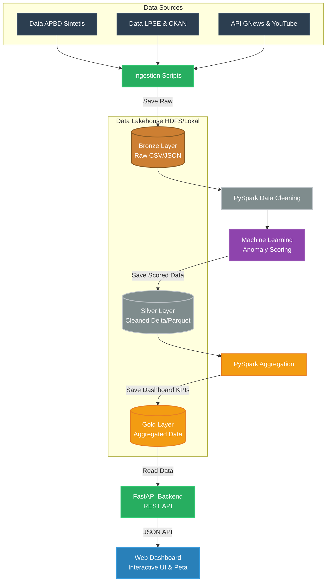

<div align="center">

# 💰 SmartBudget

### Platform Lakehouse untuk Deteksi Anomali & Transparansi APBD Kota

<br/>


<br/>

**Sistem Big Data end-to-end yang mengintegrasikan Data Lakehouse, Machine Learning,**
**dan NLP untuk mendeteksi anomali belanja APBD serta mendorong transparansi fiskal kota.**

<br/>

[Tentang Proyek](#-tentang-proyek) · [Fitur Utama](#-fitur-utama) · [Arsitektur](#-arsitektur-solusi) · [Instalasi](#-instalasi--quick-start) · [Dokumentasi](#-metodologi--reproduksi)

</div>

---

## 👥 Tim Pengembang

<div align="center">

| No | Nama | NRP | Role |
|:--:|:-----|:----|:-----|
| 1 | Rayhan Agnan Kusuma | 5027241102 | ☁️ Cloud Architect & Dashboard Designer |
| 2 | Az Zahra Tasya Adelia | 5027241087 | 🔄 Data Ingestion & Streaming Engineer |
| 3 | Dimas Satya Andhika | 5027241032 | 🏗️ Lakehouse & Spark Engineer |
| 4 | Raya Ahmad Syarif | 5027241041 | 🕵️ Machine Learning & Graph Engineer |
| 5 | Tasya Aulia Darmawan | 5027241009 | 🧠 NLP Data Scientist |

</div>

<br/>

### 🛠️ Detail Peran

<details>
<summary><b>☁️ Rayhan Agnan Kusuma — Cloud Architect & Dashboard Designer</b></summary>

> Fokus pada infrastruktur cloud dan hasil akhir (end-user experience).

**Tanggung Jawab:** Melakukan deployment klaster pendukung, mengatur konektivitas antar-layanan, dan membangun dasbor SmartBudget yang interaktif.

**Tech Stack:** `AWS / GCP` · `Docker / Kubernetes` · `Apache Superset / Grafana` · `UI/UX Design`

</details>

<details>
<summary><b>🔄 Az Zahra Tasya Adelia — Data Ingestion & Streaming Engineer</b></summary>

> Berperan sebagai garda terdepan untuk menyedot (scrape) dan mengalirkan data mentah.

**Tanggung Jawab:** Membuat skrip scraper untuk mengambil data anggaran dari portal SIPD/daerah, mengunduh PDF laporan BPK, dan menarik data Twitter/berita via API. Memastikan aliran data tidak terputus.

**Tech Stack:** `Python (Scrapy, Selenium, BeautifulSoup)` · `REST API` · `Apache Kafka` · `Apache Airflow`

</details>

<details>
<summary><b>🏗️ Dimas Satya Andhika — Lakehouse & Spark Engineer</b></summary>

> Bertanggung jawab atas jantung pemrosesan data (Arsitektur Medallion) agar komputasinya efisien.

**Tanggung Jawab:** Merancang skema tabel Bronze (mentah), Silver (dibersihkan), dan Gold (agregat siap analitik). Melakukan join antara data tabel SIPD dengan data sentimen publik secara terdistribusi.

**Tech Stack:** `Apache Spark (PySpark / Scala)` · `Delta Lake / Apache Iceberg` · `SQL`

</details>

<details>
<summary><b>🕵️ Raya Ahmad Syarif — Machine Learning & Graph Engineer</b></summary>

> Bertugas menjadi "detektif angka" untuk menemukan anomali anggaran dan aliran dana.

**Tanggung Jawab:** Menerapkan algoritma deteksi anomali pada nilai-nilai pos belanja APBD dan membangun model graf untuk mendeteksi hubungan mencurigakan antar entitas (misal: vendor dengan alamat yang sama).

**Tech Stack:** `Scikit-Learn (Isolation Forest, Benford's Law)` · `Neo4j (Graph Database)` · `Pandas`

</details>

<details>
<summary><b>🧠 Tasya Aulia Darmawan — NLP Data Scientist</b></summary>

> Berfokus membongkar data yang tidak terstruktur (teks) menjadi sinyal yang bermakna.

**Tanggung Jawab:** Mengekstrak teks dari dokumen PDF (Laporan BPK), melakukan analisis sentimen dari cuitan warga/berita, dan mengekstrak entitas (Nama Pejabat, Dinas, Lokasi) dari teks menggunakan model bahasa.

**Tech Stack:** `IndoBERT` · `Hugging Face Transformers` · `NLTK / SpaCy` · `Tesseract OCR`

</details>

<br/>

> 📚 **Final Project — Big Data & Data Lakehouse**

---

## 📖 Tentang Proyek

### Masalah

Pengawasan Anggaran Pendapatan dan Belanja Daerah (APBD) secara manual sangat **tidak efisien** dan **rentan terhadap kecurangan** (*fraud*). Dengan volume transaksi pengadaan yang mencapai **jutaan baris per tahun**, pendekatan konvensional gagal mendeteksi pola anomali seperti penggelembungan dana, ketidakwajaran realisasi, atau monopoli vendor secara tepat waktu.

### Solusi

**SmartBudget** adalah platform *End-to-End Data Lakehouse* berbasis Big Data yang dirancang untuk:

1. **Menelan (*ingest*)** data pengadaan APBD secara masif dari berbagai sumber — data transaksional (LPSE/CKAN), berita publik (GNews API), dan media sosial (YouTube API).
2. **Memproses & mendeteksi** anomali pengeluaran menggunakan arsitektur **Medallion (Bronze → Silver → Gold)** yang dipadukan dengan model Machine Learning (*Isolation Forest*).
3. **Memvisualisasikan** seluruh wawasan melalui dashboard interaktif berkinerja tinggi — lengkap dengan peta spasial, heatmap anomali, jejaring entitas, dan analisis sentimen publik — demi mendorong **transparansi fiskal** bagi pemerintah kota dan masyarakat.

---

## 🚀 Fitur Utama

| Fitur | Deskripsi |
|:------|:----------|
| 🏗️ **Pipeline End-to-End** | Alur data otomatis dari *ingestion* mentah hingga visualisasi siap pakai, dibangun di atas PySpark dan Delta Lake |
| 🧠 **Deteksi Anomali ML** | Model *Isolation Forest* & Z-Score yang berjalan terdistribusi untuk mendeteksi transaksi janggal pada paket pengadaan |
| 📰 **Analisis Sentimen NLP** | Sistem *crawling* cerdas yang mengekstrak opini publik dari berita (GNews) dan komentar YouTube terkait SKPD |
| 🗺️ **Peta Spasial Interaktif** | Visualisasi *choropleth* berbasis Leaflet.js untuk memetakan risiko anomali per kecamatan |
| 🔥 **Heatmap Anomali** | Pemetaan intensitas anomali untuk identifikasi cepat wilayah-wilayah bermasalah |
| 🕸️ **Jejaring Entitas** | Grafik relasi vendor–dinas–proyek untuk mengungkap potensi konflik kepentingan dan monopoli tender |
| ⚡ **Dashboard Real-time** | Antarmuka web responsif dengan Night Mode, ditenagai oleh FastAPI backend dan Vanilla JS/Tailwind CSS |

---

## 🏛️ Arsitektur Solusi

### Medallion Data Lakehouse

SmartBudget mengadopsi **Medallion Architecture** — sebuah pola desain *data lakehouse* berlapis yang memisahkan data berdasarkan tingkat kematangannya:

| Layer | Fungsi | Format |
|:------|:-------|:-------|
| 🥉 **Bronze** | Penyimpanan data mentah apa adanya (*raw ingestion*) | CSV, JSON |
| 🥈 **Silver** | Data yang telah dibersihkan, dinormalisasi, dan diberi skor anomali oleh ML | Delta Lake, Parquet |
| 🥇 **Gold** | Agregasi final berupa KPI, statistik, dan metrik siap konsumsi oleh dashboard | Delta Lake |

Pendekatan berlapis ini memastikan **data mentah selalu tersimpan aman** (*immutable*), proses pembersihan dan deteksi ML dilakukan secara terisolasi di lapisan Silver, sementara lapisan Gold menyajikan data yang telah dioptimasi untuk *query* berkecepatan tinggi ke frontend.



---

## 🛠️ Tech Stack

<table>
<tr>
<td align="center" width="180"><b>Kategori</b></td>
<td><b>Teknologi</b></td>
</tr>
<tr>
<td align="center">⚙️ <b>Big Data Engine</b></td>
<td>Apache Spark, PySpark</td>
</tr>
<tr>
<td align="center">💾 <b>Data Lake Storage</b></td>
<td>Delta Lake, Parquet, CSV</td>
</tr>
<tr>
<td align="center">🔌 <b>Backend & API</b></td>
<td>FastAPI, Uvicorn, Python 3.12</td>
</tr>
<tr>
<td align="center">🧠 <b>Machine Learning</b></td>
<td>Scikit-Learn (Isolation Forest), Spark MLlib</td>
</tr>
<tr>
<td align="center">📰 <b>Web Scraping / NLP</b></td>
<td>BeautifulSoup, NLTK, TextBlob</td>
</tr>
<tr>
<td align="center">🖥️ <b>Dashboard</b></td>
<td>HTML5, Vanilla JavaScript, Tailwind CSS, Leaflet.js, Chart.js, Vis.js</td>
</tr>
</table>

---

## 📂 Struktur Proyek

```text
SmartBudget-Lakehouse/
│
├── 📁 data/
│   ├── bronze/              # Data mentah awal (Raw Ingestion)
│   ├── silver/              # Data bersih & skor anomali ML (Cleaned)
│   └── gold/                # Data teragregasi untuk Dashboard (Aggregated)
│
├── 📁 src/
│   ├── api/                 # Backend FastAPI (main.py, routes)
│   ├── dashboard/           # UI Dashboard (HTML, JS, CSS)
│   ├── ingestion/           # Skrip penarikan data (Generators & Crawlers)
│   ├── lakehouse/           # Pipeline Medallion (Transformasi PySpark)
│   ├── ml_engine/           # Logika Machine Learning & Model
│   └── nlp_engine/          # Analisis Sentimen Teks
│
├── 📁 hadoop/               # Dependensi lokal Spark untuk Windows
├── 📄 requirements.txt      # Daftar pustaka Python
├── 📄 run_ingestion.sh      # Script eksekusi otomatis Data Pipeline
└── 📄 README.md             # Dokumentasi utama (file ini)
```

---

## 📋 Prasyarat (*Prerequisites*)

Pastikan perangkat lunak berikut telah terpasang di sistem Anda sebelum melanjutkan instalasi:

| Perangkat Lunak | Versi Minimum | Keterangan |
|:----------------|:--------------|:-----------|
| **Python** | 3.10+ | Bahasa pemrograman utama |
| **Java JDK** | 8 atau 11 | Diperlukan oleh Apache Spark / PySpark |
| **Git** | 2.x | Untuk *cloning* repositori |
| **pip** | 23+ | Python package manager |

> ⚠️ **Catatan Windows**: Proyek ini menyertakan `hadoop/` yang berisi `winutils.exe` untuk menjalankan PySpark di lingkungan Windows tanpa instalasi Hadoop penuh.

---

## ⚡ Instalasi & Quick Start

### 1️⃣ Clone & Install Dependencies

```bash
# Clone repositori
git clone https://github.com/username/SmartBudget-Lakehouse.git
cd SmartBudget-Lakehouse

# Buat virtual environment (disarankan)
python -m venv .venv
.venv\Scripts\activate          # Windows
# source .venv/bin/activate     # macOS/Linux

# Install seluruh dependensi
pip install -r requirements.txt
```

### 2️⃣ Konfigurasi Hadoop (Khusus Windows)

Atur *Environment Variable* agar PySpark dapat berjalan di Windows:

```powershell
$env:HADOOP_HOME = "$PWD\hadoop"
$env:PATH += ";$PWD\hadoop\bin"
```

### 3️⃣ Jalankan Data Pipeline & Machine Learning

Eksekusi *bash script* berikut untuk memicu seluruh proses — mulai dari ingestion, pemrosesan Medallion, hingga scoring anomali ML — secara otomatis:

```bash
./run_ingestion.sh
```

### 4️⃣ Jalankan Web Dashboard & API

Setelah data Gold Layer tersedia, aktifkan server backend:

```bash
python -m src.api.main
```

Buka browser dan akses dashboard di:

> 🌐 **http://localhost:8080**

---

## 📘 Metodologi & Reproduksi

Untuk mereproduksi pipeline secara **manual** (langkah demi langkah), jalankan perintah berikut secara berurutan:

### Tahap 1 — Pengumpulan Data *(Bronze Layer)*

Menghasilkan dataset sintetis APBD dan menarik data dari LPSE, CKAN, serta YouTube API ke `data/bronze/`.

```bash
python -m src.ingestion.generate_apbd_synthetic
python -m src.ingestion.ingest_lpse
```

### Tahap 2 — Pembersihan & Transformasi *(Silver Layer)*

PySpark melakukan standarisasi format, pembersihan data *Null/Duplicate*, dan normalisasi ke format Delta Lake di `data/silver/`.

```bash
python -m src.lakehouse.silver_transform
```

### Tahap 3 — Pemodelan Machine Learning *(Anomaly Detection)*

Melatih model *Isolation Forest* pada data Silver untuk mendeteksi penggelembungan dana dan memberikan *Anomaly Score* per transaksi.

```bash
python -m src.ml_engine.anomaly_detector
```

### Tahap 4 — Agregasi Data *(Gold Layer)*

Menghasilkan tabel ringkasan KPI per kecamatan/SKPD untuk kebutuhan analitik di sisi frontend (`data/gold/`).

```bash
python -m src.lakehouse.gold_transform
```

### Tahap 5 — Analisis Sentimen NLP *(Opsional)*

Mengekstrak opini polaritas (Positif/Negatif) dari komentar publik terkait proyek SKPD.

```bash
python -m src.ingestion.ingest_youtube_comments
```

### Tahap 6 — Backend & Visualisasi *(FastAPI + Dashboard)*

Mengaktifkan server FastAPI yang merutekan REST API (`/api/anomalies`, `/api/summary`) dan menyajikan Web Dashboard interaktif.

```bash
python -m src.api.main
```

---

## 📊 Dataset

| Atribut | Detail |
|:--------|:-------|
| **Nama** | Synthetic APBD Surabaya & LPSE Data (Data Simulasi Berbasis Pola Asli) |
| **Skala** | Jutaan baris (Big Data Simulation) |
| **Format** | CSV / JSON (Terstruktur) |
| **Usability Score** | 10.0 |

**Mengapa dataset ini dipilih?**

- **🔢 Skala Enterprise** — Ukurannya yang masif dirancang khusus untuk mendemonstrasikan kapabilitas komputasi paralel Apache Spark dan format Delta Lake.
- **🔍 Studi Kasus Fraud Detection** — Mendeteksi anomali (penggelembungan dana, ketidakwajaran realisasi) merupakan permasalahan nyata yang krusial di sektor pemerintahan.
- **🔗 Multi-Source Integration** — Menggabungkan data transaksional terstruktur (APBD/LPSE) dengan data tidak terstruktur (teks sentimen berita) menjadikan pipeline ini komprehensif dan representatif.

---

## 📸 Tangkapan Layar

### Dashboard Utama & KPI

<div align="center">


*Tampilan ringkasan eksekutif, tren waktu realisasi, dan proporsi risiko anggaran.*

</div>

### Peta Spasial Interaktif

<div align="center">


*Pemetaan risiko anomali APBD berbasis geografis (Choropleth) per kecamatan.*

</div>

### Analisis Sentimen (NLP)

<div align="center">


*Analisis opini publik terhadap berita dan media sosial terkait SKPD.*

</div>

> 💡 *Ganti URL placeholder di atas dengan path gambar asli saat mengunggah ke repositori GitHub.*

---

<div align="center">

**📚 Proyek ini diajukan sebagai Final Project mata kuliah Big Data & Data Lakehouse.**

<br/>

*Dibangun dengan ❤️ menggunakan PySpark, Delta Lake, dan FastAPI*

</div>
