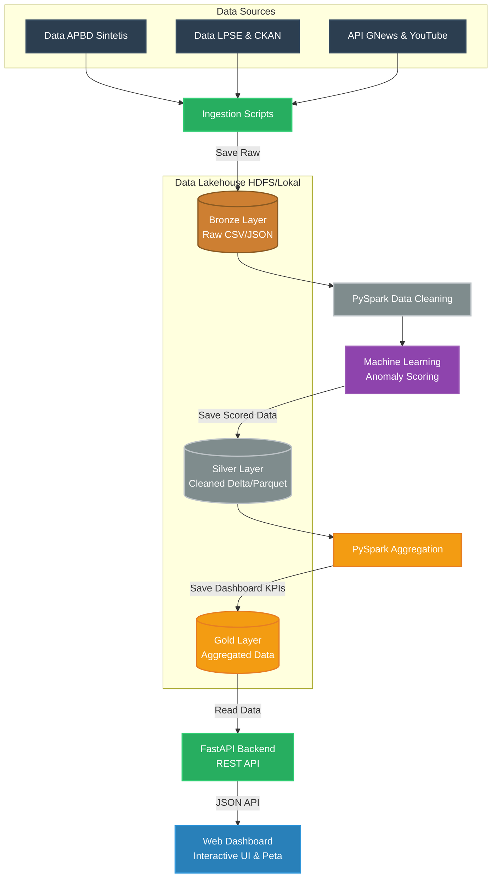

# Final Project : Big Data & Data Lakehouse

## Daftar Anggota

| No | Nama Lengkap                  | NRP         |
|----|-------------------------------|-------------|
| 1  | [Nama Anggota 1]              | [NRP 1]     |
| 2  | [Nama Anggota 2]              | [NRP 2]     |
| 3  | [Nama Anggota 3]              | [NRP 3]     |
| 4  | [Nama Anggota 4]              | [NRP 4]     |

# SmartBudget: Platform Lakehouse untuk Deteksi Anomali & Transparansi APBD Kota

## Deskripsi Masalah

Pengawasan Anggaran Pendapatan dan Belanja Daerah (APBD) secara manual sangat tidak efisien dan rentan terhadap kecurangan (fraud) mengingat volume transaksi pengadaan yang mencapai jutaan baris per tahun. Proyek ini bertujuan untuk membangun platform *End-to-End Data Lakehouse* berbasis Big Data yang dapat menelan (ingest) data pengadaan secara masif, memprosesnya dengan arsitektur Medallion, dan mendeteksi anomali pengeluaran menggunakan Machine Learning. Hasil deteksi kemudian divisualisasikan melalui *dashboard* interaktif yang mempromosikan transparansi bagi publik dan pemerintah kota.

## Tujuan Proyek

- Membangun pipeline data Big Data end-to-end menggunakan **PySpark** dan **Delta Lake** untuk memproses data dari skala mentah hingga siap saji (Arsitektur Medallion: Bronze, Silver, Gold).
- Mengimplementasikan model Machine Learning (Isolation Forest / Ensemble) secara terdistribusi untuk mendeteksi transaksi anomali pada paket pengadaan APBD.
- Membangun sistem *crawling* NLP untuk analisis sentimen dari berita (API GNews) dan media sosial (API YouTube) guna memantau persepsi publik terhadap instansi/dinas.
- Menyajikan seluruh wawasan, peta spasial, dan *heatmap* anomali dalam sebuah *dashboard* interaktif yang berkecepatan tinggi menggunakan **FastAPI** dan **Vanilla JS/Tailwind CSS**.

## Dataset

- **Nama Dataset**: Synthetic APBD Surabaya & LPSE Data (Data Simulasi Berbasis Pola Asli)
- **Ukuran**: Skala Jutaan Baris (Big Data Simulation)
- **Format**: CSV / JSON (Terstruktur)
- **Usability Score**: 10.0
- **Deskripsi**: Dataset ini memuat data paket pengadaan APBD, nilai pagu, realisasi, tanggal kontrak, serta pemenang tender dari berbagai Dinas (SKPD). Selain itu terdapat dataset komentar dan berita eksternal untuk keperluan NLP.

### Mengapa Dataset Ini Cocok?

- **Skala Data Enterprise**: Ukurannya yang sangat masif dirancang khusus untuk mendemonstrasikan kapabilitas komputasi paralel dari Apache Spark dan format Delta Lake.
- **Masalah Deteksi Fraud**: Mendeteksi anomali (penggelembungan dana, ketidakwajaran realisasi) adalah studi kasus nyata yang sangat relevan dan krusial di sektor pemerintahan.
- **Kombinasi Beragam Sumber**: Menggabungkan data transaksional terstruktur (APBD/LPSE) dengan data tidak terstruktur (teks sentimen berita), menjadikan pipeline *Big Data* ini komprehensif.

---

## Arsitektur Solusi (Medallion Data Lakehouse)



Pendekatan **Medallion Architecture (Bronze, Silver, Gold)** sangat ideal untuk memvalidasi dan memproses data APBD secara bertahap. Arsitektur ini memastikan data mentah tersimpan dengan aman, dibersihkan dan diperkaya di layer Silver (di mana deteksi Machine Learning dijalankan), serta diagregasi secara optimal di layer Gold untuk disajikan dengan latensi yang sangat rendah kepada pengguna melalui Dashboard.

## Komponen

| Komponen     | Deskripsi |
|--------------|-----------|
| **Apache Spark (PySpark)** | Core engine untuk ETL paralel terdistribusi, transformasi Medallion, dan Machine Learning (*Anomaly Detection*). |
| **Delta Lake** | Format penyimpanan *open-source* yang memberikan kapabilitas ACID *transactions* dan *time-travel* pada Data Lake.|
| **Hadoop Winutils** | Menyediakan environtment lokal HDFS di Windows untuk eksekusi Spark secara optimal.|
| **FastAPI** | Backend API berkecepatan tinggi yang menyajikan agregasi data layer Gold ke sistem *frontend*. |
| **Vanilla JS & Tailwind** | Membangun dashboard analitik spasial dan *heatmap* yang interaktif tanpa bergantung pada *framework frontend* berat. |
| **Python NLP** | Modul terpisah untuk ekstraksi sentimen masyarakat dari media eksternal (GNews, RSS). |

### Tech Stack

| Kategori              | Teknologi                                      |
|-----------------------|------------------------------------------------|
| **Big Data Engine**   | Apache Spark, PySpark                          |
| **Data Lake Storage** | Delta Lake, Parquet, CSV                       |
| **Backend & API**     | FastAPI, Uvicorn, Python 3.12                  |
| **Machine Learning**  | Scikit-Learn (Isolation Forest), Spark MLlib   |
| **Web Scraping/NLP**  | BeautifulSoup, NLTK, TextBlob                  |
| **Dashboard**         | HTML5, Vanilla JavaScript, Tailwind CSS, Leaflet.js |

---

## Alur Pipa Data (Data Pipeline Flow)

1. **Ingestion (Raw/Bronze Layer)**: Skrip Python (`ingest_*.py`) menarik data secara *synthetic* maupun dari API eksternal, kemudian menyimpannya ke folder `data/bronze/` dalam bentuk `.csv` atau `.json`.
2. **Processing & Machine Learning (Silver Layer)**: PySpark membaca data Bronze, membersihkan data yang *null/duplicate*, dan melakukan *scoring* anomali menggunakan model *Machine Learning* (Z-Score & Isolation Forest). Data yang telah ter-skoring disimpan ke format Delta Lake (`data/silver/`).
3. **Aggregation (Gold Layer)**: PySpark mengagregasi data dari Silver menjadi data statistik siap pakai (misalnya total anomali per SKPD, Top 5 Vendor Janggal, dsb) dan menyimpannya di `data/gold/`.
4. **Serving (FastAPI & Dashboard)**: Backend FastAPI membaca data dari Gold Layer dan merutekannya sebagai REST API (`/api/anomalies`, `/api/summary`) yang kemudian divisualisasikan oleh Dashboard Frontend.

---

## Struktur Proyek
```text
SmartBudget-Lakehouse
├── data/
│   ├── bronze/          # Data mentah awal (Raw)
│   ├── silver/          # Data yang telah dibersihkan & diprediksi (Cleaned)
│   └── gold/            # Data teragregasi untuk Dashboard (Aggregated)
├── src/
│   ├── api/             # Backend FastAPI (main.py)
│   ├── dashboard/       # UI Dashboard (HTML, JS, CSS)
│   ├── ingestion/       # Skrip penarikan data (Data Generators & Crawlers)
│   ├── lakehouse/       # Pipa data Medallion (transformasi PySpark)
│   ├── ml_engine/       # Logika Machine Learning & Model
│   └── nlp_engine/      # Analisis Sentimen Teks
├── hadoop/              # Dependensi lokal Spark untuk Windows
├── requirements.txt     # Daftar pustaka Python
├── run_ingestion.sh     # Bash script eksekusi Data Pipeline
└── README.md            # Dokumentasi utama (File ini)
```

---

## Cara Instalasi & Menjalankan Proyek (Local Execution)

Berikut adalah langkah-langkah untuk menjalankan *End-to-End Pipeline* di komputer lokal Anda (Sistem Operasi Windows):

### 1. Persiapan Environment
Pastikan Anda memiliki **Python 3.10+** dan **Java 8 / 11** (syarat PySpark).
```bash
# Clone repository
git clone https://github.com/username/SmartBudget-Lakehouse.git
cd SmartBudget-Lakehouse

# Install Python Requirements
pip install -r requirements.txt
```

### 2. Konfigurasi Hadoop (Untuk Windows)
Atur *Environment Variable* agar PySpark dapat berjalan di Windows.
```powershell
$env:HADOOP_HOME = "$PWD\hadoop"
$env:PATH += ";$PWD\hadoop\bin"
```

### 3. Menjalankan Data Pipeline & Machine Learning
Jalankan file *bash script* berikut untuk memicu ekstraksi data, pemrosesan Medallion, dan perhitungan skor Machine Learning secara otomatis.
```bash
./run_ingestion.sh
```

### 4. Menjalankan Web Dashboard & API
Setelah data Gold tersedia, jalankan server web FastAPI:
```bash
python -m src.api.main
```
Akses Dashboard secara interaktif di browser Anda melalui: **http://localhost:8080**

---

## Langkah Pengerjaan & Reproduksi (Methodology)

Untuk mereproduksi *pipeline* secara manual (langkah demi langkah), Anda dapat menjalankan perintah berikut secara berurutan:

### 1. Pengumpulan Data (Data Ingestion - Bronze Layer)
Menggunakan skrip Python untuk meng-*generate* dataset sintetis APBD dan menarik data dari LPSE, CKAN, serta YouTube API, kemudian menyimpannya ke `data/bronze/`.
```bash
python -m src.ingestion.generate_apbd_synthetic
python -m src.ingestion.ingest_lpse
```

### 2. Pembersihan & Transformasi (Silver Layer)
Memanfaatkan Apache Spark untuk standarisasi format, pembersihan data *Null/Duplicate*, dan agregasi awal ke format Delta Lake di `data/silver/`.
```bash
python -m src.lakehouse.silver_transform
```

### 3. Pemodelan Machine Learning (Anomaly Detection)
Melatih model *Isolation Forest* pada data Silver untuk mendeteksi penggelembungan dana dan memberikan *Anomaly Score*.
```bash
python -m src.ml_engine.anomaly_detector
```

### 4. Data Aggregation (Gold Layer)
Menghasilkan tabel ringkasan (KPI) per kecamatan/SKPD unftuk kebutuhan analitik tinggi di sisi *frontend* (`data/gold/`).
```bash
python -m src.lakehouse.gold_transform
```

### 5. Analisis Sentimen NLP (Opsional)
Menggunakan NLP untuk mengekstrak opini polaritas (Positif/Negatif) dari komentar publik terkait proyek SKPD.
```bash
python -m src.ingestion.ingest_youtube_comments
```

### 6. Menjalankan Backend & Visualisasi (FastAPI + UI)
Membangun backend FastAPI untuk merutekan *REST API* yang dikonsumsi oleh *Web Dashboard* interaktif (Peta Spasial & Heatmap).
```bash
python -m src.api.main
```

---

## Tangkapan Layar (Screenshots)

### 1. Dashboard Utama & KPI

*Tampilan Ringkasan Eksekutif, Tren Waktu, dan Proporsi Risiko.*

### 2. Peta Spasial Interaktif

*Pemetaan Risiko Anomali APBD berbasis Geografis (Choropleth/Titik).*

### 3. Analisis Sentimen (NLP)

*Analisis Opini Publik terhadap Berita dan Media Sosial SKPD Terkait.*

*(Ganti URL gambar di atas dengan tautan/path gambar aslimu saat mengunggah ke repositori GitHub)*

---
*Proyek ini diajukan untuk Kompetisi Gemastik / Tugas Akhir Big Data & Data Lakehouse.*
